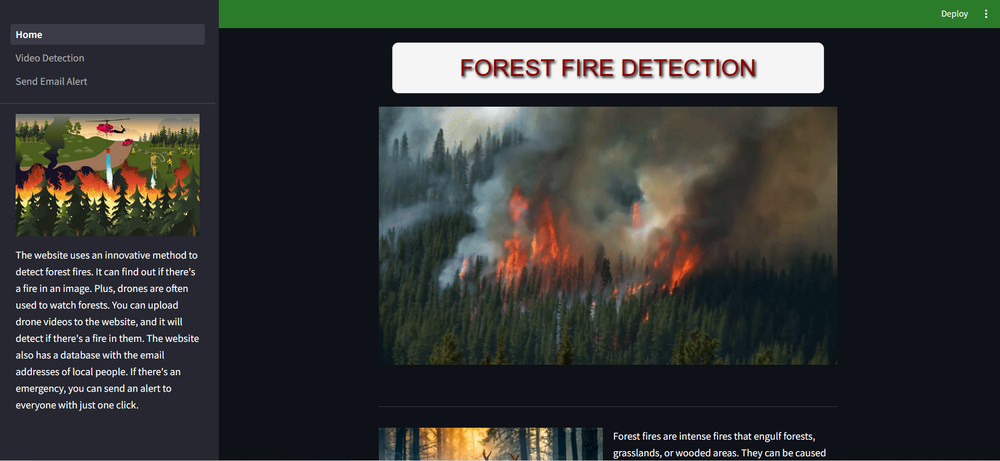
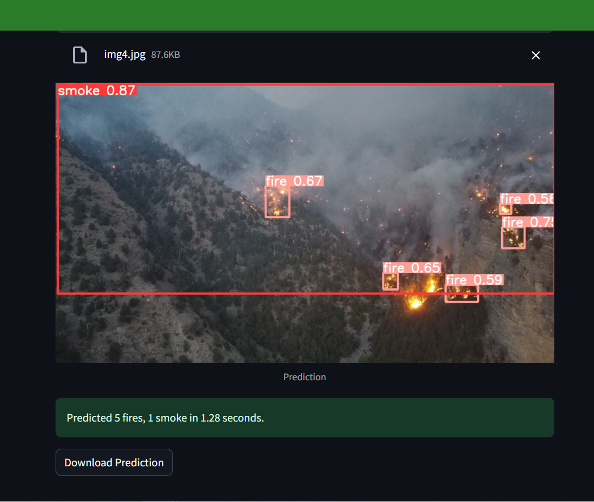
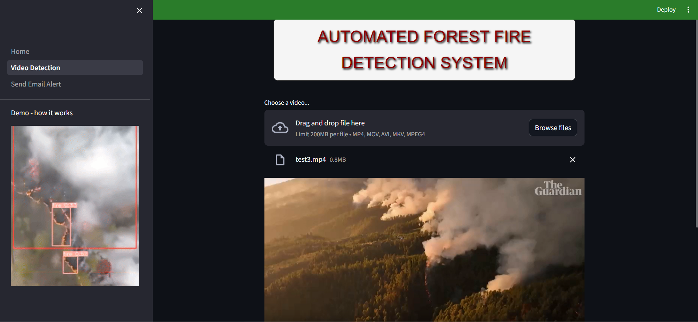
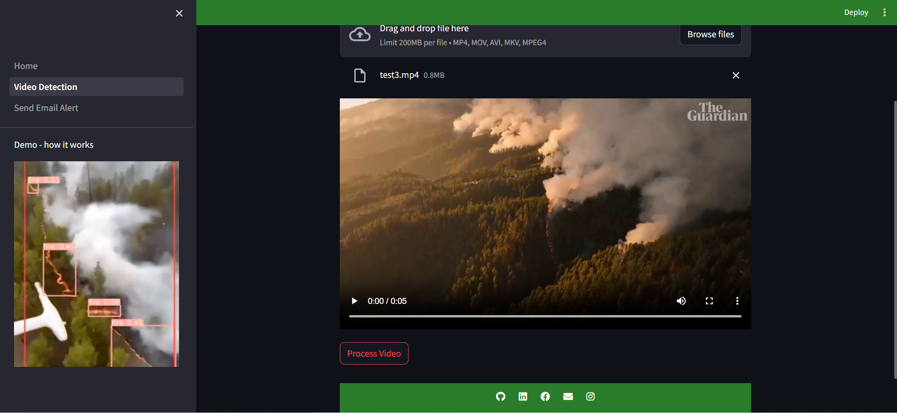
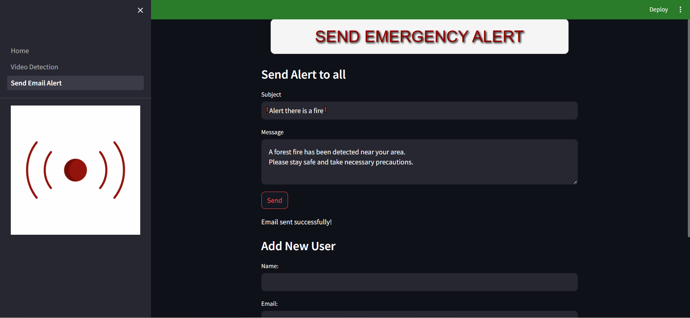
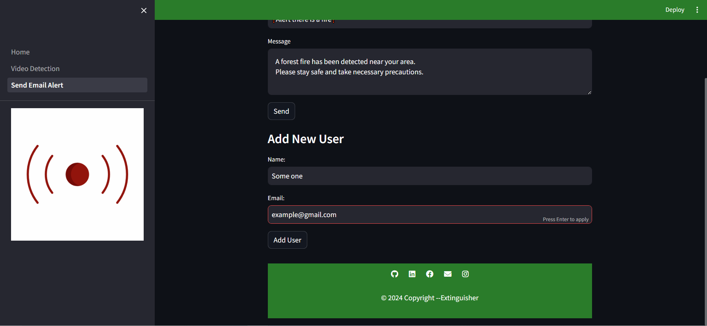

# FireGuard

**Extinguisher** is a Streamlit app that detects forest fires in video. It allows users to upload videos and detect the presence of fires. The app can also trigger email alerts to notify users of detected forest fires.

## Features
- Video upload and processing
- Forest fire detection
- Download processed videos
- Email alert system

## Mockups
<div style="display: flex; flex-direction: row; overflow-x: scroll; align-item: center;">
    
</div>
The Home page: You can use image-based detection tools to identify fire and smoke. We've also included some information about forest fires, along with a brief discussion of some of the most devastating fires in history.


<br>
<br>
<br>

<div style="display: flex; flex-direction: row; overflow-x: scroll; align-item: center;">
    
</div>
Prediction over a sample image

<br>
<br>
<br>

<div style="display: flex; flex-direction: row; overflow-x: scroll; align-item: center;">
    
    
</div>
Video-Based Fire Detection System: This page allows users to upload a drone video (or a similar recording). Our system analyzes the video to detect and mark any signs of fire or smoke, providing clear annotations on the footage.
<br>
<br>
<br>

<div style="display: flex; flex-direction: row; overflow-x: scroll; align-item: center;">
    
</div>
Emergency Alert System: This feature lets users store the emails of local residents in a database. In case of emergencies, you can send an email alert to everyone with a single click.
<br>
<br>
<br>

<div style="display: flex; flex-direction: row; overflow-x: scroll; align-item: center;">
    
</div>
New emails can be added through this field.

<br>
<br>
<br>


## Installation
1. Clone the repository to your local machine:
   ```bash
   git clone https://github.com/yourusername/your-repo-name.git
   ```
2. Change to the app directory:
   ```bash
   cd Extinguisher
   ```
3. Install the required dependencies from requirements.txt:
     ```bash
     pip install -r requirements.txt
    ```
**NOTE: For security reasons, the `credentials.json` file has not been uploaded to the repository. This file contains essential API information for Firebase Firestore. To ensure the safety of your project and sensitive data, it's imperative that users add their own `credentials.json` file before initiating the application. Please place your `credentials.json` file in the root directory of the project before starting the app.**
## Running the App
1. Start the Streamlit app by running:
   ```bash
   streamlit run Home.py
   ```
2. Open your browser and navigate to the local server address provided by Streamlit (usually http://localhost:8501).

## Contributing
We welcome contributions! If you'd like to contribute to the project, please follow these steps:
1. Fork the repository.
2. Create a new branch for your feature or bug fix.
3. Commit your changes and push them to your branch.
4. Submit a pull request, and we'll review it as soon as possible
